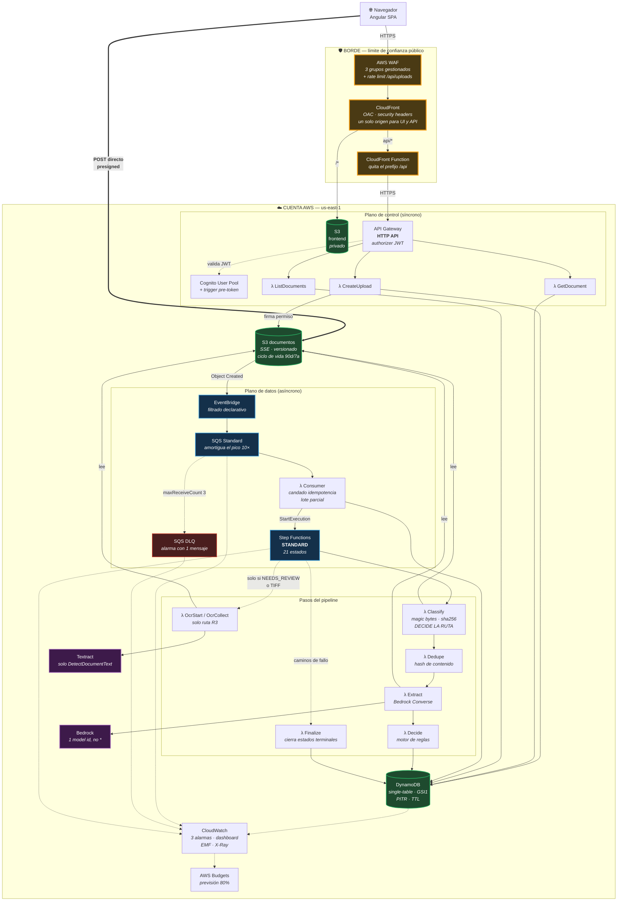

# Vista de despliegue en AWS

El diagrama que van a mirar. Cajas por servicio, flechas con el protocolo y
**los límites de confianza dibujados**.

## Las cinco cosas que hay que mirar en este diagrama

1. **La flecha gruesa del navegador a S3 no pasa por la API.** Es la decisión
   más visible del diseño (ADR-002). El backend firma un permiso; nunca toca los
   bytes. Elimina el límite de 10 MB, el coste de transferencia y la superficie
   de ataque de mover archivos por Lambda.

2. **Una sola distribución de CloudFront sirve la UI y la API.** No es estética:
   una HTTP API no admite WAF asociado, y ponerla detrás de CloudFront lo
   recupera. De propina, al compartir origen desaparece el preflight CORS.

3. **La CloudFront Function existe por una razón concreta.** El prefijo `/api`
   es un artefacto del navegador; la API no lo conoce. Sin el rewrite,
   CloudFront reenvía `/api/uploads` y API Gateway devuelve 404 a todo.

4. **Las flechas punteadas hacia OCR son condicionales, y ahí está el dinero.**
   Textract solo se llama en dos casos: cuando el modelo no puede leer el
   formato (TIFF) o cuando la decisión ya salió `NEEDS_REVIEW`. En el resto del
   volumen —la inmensa mayoría— **no se llama nunca** (ADR-011).

5. **Los límites de confianza están dibujados, no implícitos.** El borde es
   público; la cuenta es privada; y el plano de datos no tiene ninguna entrada
   desde fuera: solo se alimenta de eventos de S3.

## Lo que NO hay, y es deliberado

| Ausencia | Por qué |
|---|---|
| **VPC, subredes, NAT** | Ningún componente necesita red privada: todo son servicios gestionados con endpoints públicos autenticados por IAM. Una VPC aquí añadiría NAT Gateways (~$32/mes cada uno) y complejidad operativa para proteger nada |
| **Segunda región** | RTO de 4 h se cubre con PITR y versionado (ADR-010) |
| **API Gateway REST** | Más cara y de mayor latencia; su ventaja (WAF directo, usage plans) se recupera o no se necesita (ADR-001) |
| **WebSockets** | El *polling* con backoff resuelve el problema a este volumen |
| **Caché de API / provisioned concurrency** | Optimizarían el 5% de la factura |
