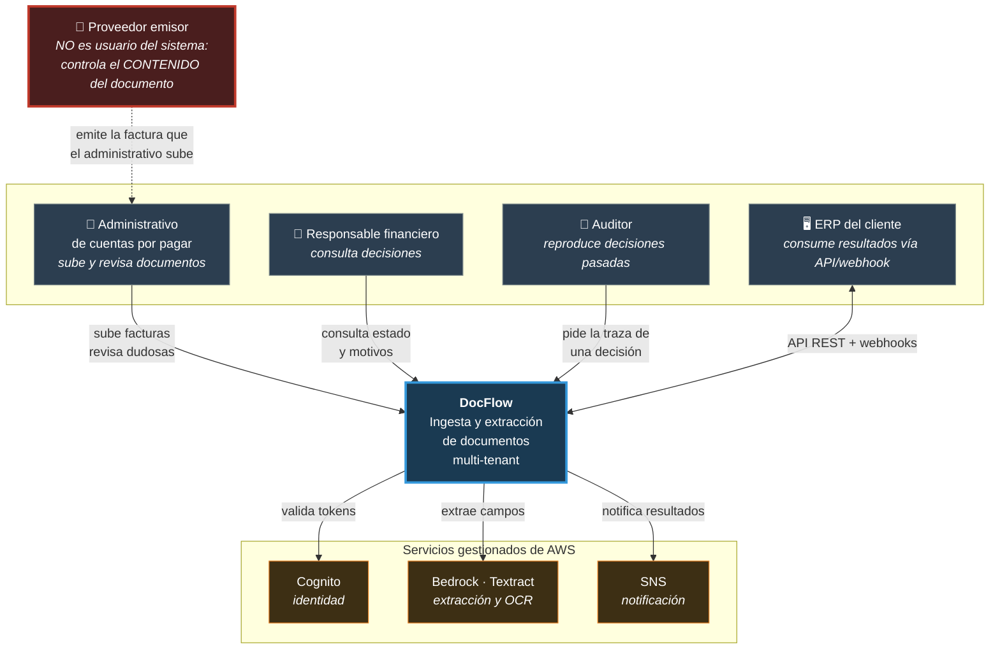

# Diagrama de contexto (C4 nivel 1)

Quién usa el sistema, con qué sistemas habla, y **dónde está la frontera de
confianza**. Nada de servicios de AWS todavía: eso es el siguiente diagrama.

## Lo que este diagrama dice y otros no

**El proveedor emisor está dibujado aunque no toque el sistema.** Es la caja más
importante del diagrama y la que casi nadie pone. No tiene credenciales, no
tiene cuenta, no hace ninguna petición — y sin embargo **controla por completo
el contenido que entra en nuestro pipeline de extracción**.

Esa es la frontera de confianza real: no está entre "usuario autenticado" y
"anónimo", está entre **nuestro código** y **el contenido del documento**. Un
administrativo legítimo, con un token legítimo, sube un documento hostil sin
saberlo.

De ahí salen dos decisiones que se ven más adelante:

- La validación del archivo se hace por **magic bytes**, no por lo que declare
  quien lo sube — porque quien lo sube también fue engañado.
- El motor de reglas **no lee el documento**: lee el JSON ya validado. Esa
  separación es lo que impide que el contenido hostil alcance la decisión
  (ADR-012).

Y una consecuencia de producto: **el sistema no confía en su propio usuario**, no
porque sospeche de él, sino porque el usuario tampoco controla lo que reenvía.
