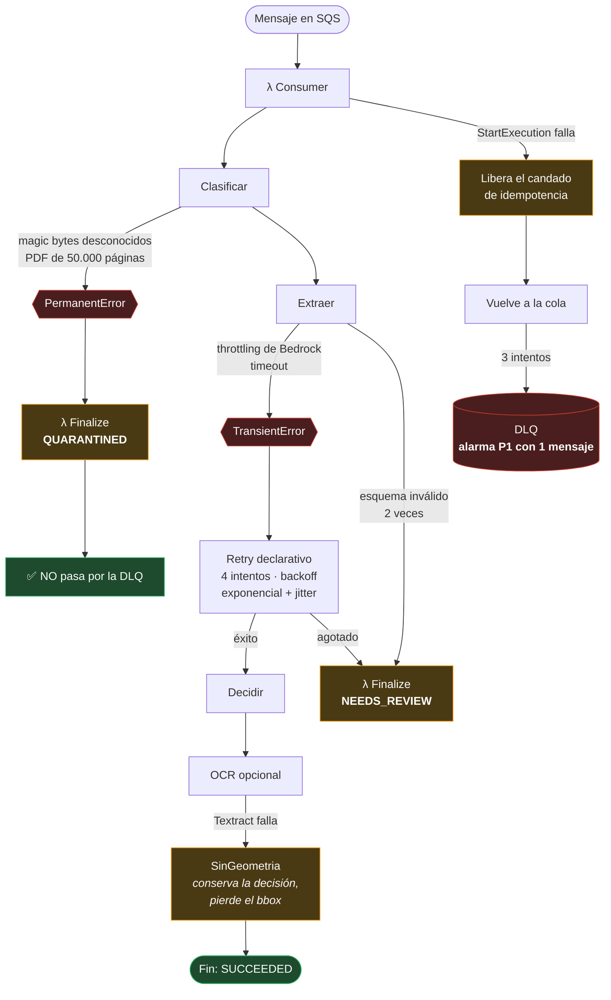

# Flujo asíncrono, incluido el camino de fallo

El diagrama que demuestra que entiendo mi propio sistema. **El camino de fallo
está dibujado con el mismo detalle que el camino feliz** — es la parte que la
mayoría omite y la única que importa a las 3 de la madrugada.

## Camino completo

```mermaid
sequenceDiagram
    autonumber
    actor U as Navegador
    participant API as API Gateway<br/>+ λ CreateUpload
    participant S3 as S3 documentos
    participant EB as EventBridge
    participant Q as SQS
    participant C as λ Consumer
    participant SF as Step Functions
    participant DB as DynamoDB
    participant BR as Bedrock

    rect rgb(20,48,74)
    Note over U,DB: 1 · Permiso de subida (síncrono, p95 < 300 ms)
    U->>API: POST /uploads {fileName, contentType, sizeBytes}
    API->>API: tenant_id ← claim del JWT<br/>(NUNCA del body)
    API->>DB: Put intent PENDING + TTL 24 h
    API-->>U: 201 {documentId, presigned POST}
    end

    rect rgb(30,74,46)
    Note over U,S3: 2 · El archivo NO pasa por la API
    U->>S3: POST multipart directo
    S3->>S3: aplica conditions:<br/>prefijo · tamaño · content-type
    S3-->>U: 204
    end

    rect rgb(74,58,20)
    Note over S3,SF: 3 · Disparo del pipeline
    S3->>EB: Object Created
    EB->>Q: regla de filtrado (prefix tenants/)
    Q->>C: lote de hasta 10 mensajes
    C->>DB: Put IDEM#key#etag<br/>ConditionExpression
    Note right of C: Si ya existe →<br/>duplicado, se descarta.<br/>Deduplica para siempre,<br/>no 5 minutos como FIFO
    C->>SF: StartExecution<br/>(nombre determinista)
    end

    rect rgb(61,26,74)
    Note over SF,BR: 4 · Pipeline orquestado
    SF->>S3: Clasificar: lee bytes
    SF->>SF: magic bytes · sha256 ·<br/>páginas · ¿capa de texto?<br/><b>DECIDE LA RUTA</b>
    SF->>DB: Deduplicar por sha256
    alt Contenido ya procesado
        SF->>DB: DUPLICATE (sin extraer: 0 coste)
    else Contenido nuevo
        SF->>BR: Extraer (Converse + toolChoice)
        BR-->>SF: JSON validado contra esquema
        SF->>DB: Decidir: motor de reglas<br/>+ persistencia transaccional
    end
    end

    rect rgb(74,30,30)
    Note over SF,DB: 5 · Compra tardía de OCR (solo si hace falta)
    alt Decisión = NEEDS_REVIEW
        SF->>SF: Textract → bbox + confianza calibrada
        SF->>BR: Re-extraer con geometría
        SF->>DB: Decidir de nuevo
    end
    end

    U->>API: GET /documents/{id} (polling con backoff)
    API-->>U: {status, hits, campos, modelId, rulesetVersion}
```

## Los caminos de fallo

## Las cuatro propiedades que este diagrama demuestra

**1. Un error permanente no llega a la DLQ.** Un PDF corrupto reintentado tres
veces son tres facturas de OCR y tres entradas de ruido en las métricas. Se
consume el mensaje y el documento va a `QUARANTINED`. **La verificación es
directa: sube un `.txt` renombrado a `.pdf` y la DLQ debe quedarse vacía.** Si
aparece ahí, la clasificación transitorio/permanente está mal.

**2. El documento nunca se pierde.** Cada camino de fallo termina escribiendo un
estado terminal en DynamoDB, con su evento de auditoría y quitando el TTL del
intent. Un `Pass` de Step Functions que solo devuelve un objeto **no escribe
nada**: la ejecución acaba en `SUCCEEDED` y el documento se evapora al expirar
el TTL 24 h después. Es pérdida de datos con aspecto de éxito, y es exactamente
el fallo que tenía la primera versión de este pipeline.

**3. El candado de idempotencia se libera si el arranque falla.** Ponerlo antes
de `StartExecution` es correcto —si no, dos entregas simultáneas arrancarían dos
ejecuciones—, pero abre un agujero: si `StartExecution` falla y el candado queda
puesto, el reintento se suprime como "duplicado" y el documento no se procesa
nunca **sin llegar a la DLQ**, porque desde fuera parece un éxito.

**4. El fallo del OCR degrada la UI, no el resultado.** La rama de geometría
corre *después* de que el documento ya tiene decisión persistida. Si Textract
falla, el revisor ve el campo dudoso sin resaltar. Hacer fallar la ejecución
ensuciaría la tasa de error con fallos que no afectan al resultado.

## Dónde se rompe la trazabilidad distribuida

X-Ray propaga el contexto de traza a través de SQS mediante el atributo de
sistema `AWSTraceHeader`, así que el salto productor→consumidor está cubierto.

**El eslabón que nadie cubre es navegador → API.** Ahí hay que inyectar el
identificador de correlación desde el cliente (CloudWatch RUM o una cabecera
propia). Nombrar el eslabón débil correcto es la diferencia entre haber
instrumentado un sistema y haber leído sobre instrumentarlo.

> El comportamiento exacto de la propagación a través de **EventBridge y Step
> Functions** lo afirmo con menos seguridad que el salto por SQS. Está marcado
> como supuesto a validar en `99-deudas-y-siguientes-pasos.md`.
